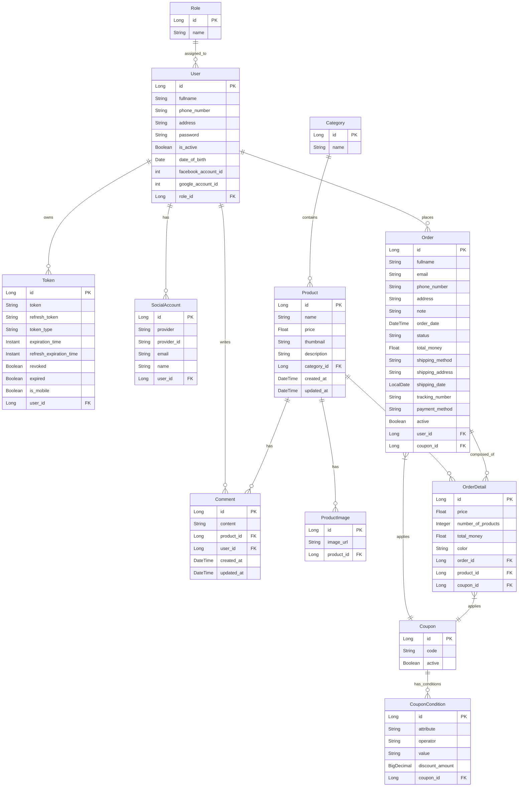

# Entity Relationship Diagram (ERD) - hola_shop Backend

## Overview

This document outlines the database schema and entity relationships for the hola_shop Backend system.

## Mermaid Diagram

## Entities Description

### 1. User Management
*   **User**: Stores user account information including credentials, profile details, and role association.
*   **Role**: Defines user roles (e.g., ADMIN, USER) for permission control.
*   **Token**: Manages JWT authentication tokens and refresh tokens, tracking validity and device type (mobile/web).
*   **SocialAccount**: Links users to external social login providers (Facebook, Google).

### 2. Product Management
*   **Category**: Groups products into logical categories (e.g., Electronics, Furniture).
*   **Product**: Contains core product details such as name, price, description, and thumbnail.
*   **ProductImage**: Stores URLs for additional images associated with a product.
*   **Comment**: Allows users to leave feedback/reviews on products.

### 3. Order Management
*   **Order**: Represents a purchase transaction, tracking status, shipping details, total amount, and the user who placed it.
*   **OrderDetail**: Links specific products to an order, capturing the quantity, price at the time of purchase, and selected attributes (e.g., color).

### 4. Marketing & Promotions
*   **Coupon**: Defines discount codes available for use.
*   **CouponCondition**: Specifies rules for applying coupons (e.g., minimum order amount, applicable date range) and the discount value.

## Database Schema History
*   The project uses **Flyway** for database migrations, ensuring schema consistency across environments. Key migrations include:
    *   `V1`: Initial schema adjustments (Category name unique, Product price decimal, etc.).
    *   `V2`: Added `is_mobile` to Tokens.
    *   `V3`: Added `refresh_expiration_time` to Tokens.
    *   `V4`: Created `comments` table.
    *   `V5`: Created `coupons` and `coupon_conditions` tables and linked them to orders.
